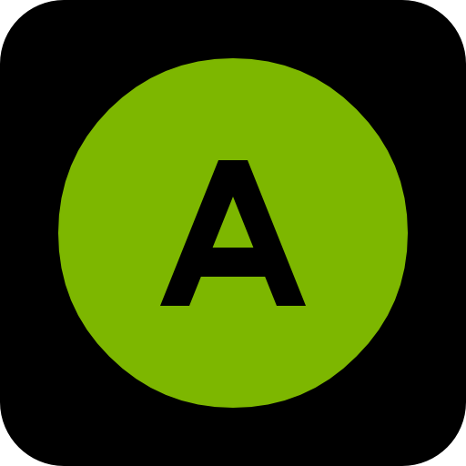
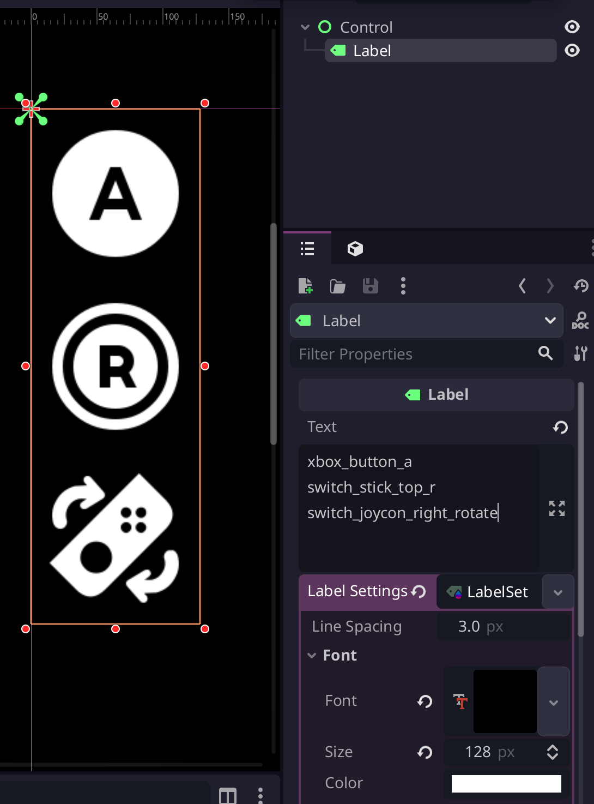
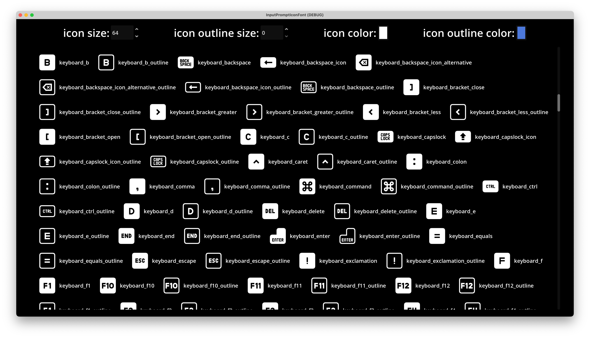
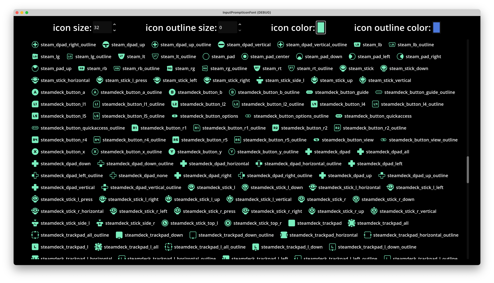
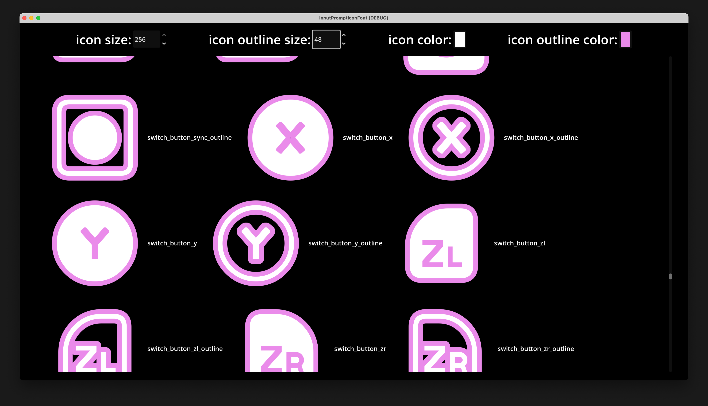

# Input Action Prompt Icon Font

This repo contains a font created from [Kenney's input prompt icons](https://kenney.nl/assets/input-prompts) and converted to a font using [icomoon](icomoon.io).

The project includes a Godot demo scene, but the font itself can be used in any engine.

## How to Use
Using Godot engine as an example:



(the editor theme used here is [Godot Minimal Theme](https://github.com/passivestar/godot-minimal-theme)  by passivestar)

Use the font in `addons/input_prompt_icon_font/icon.ttf` in Label or RichTextLabel;

Enter text like `xbox_button_a` to display the corresponding icon. The icon names match Kenney's icon names. Alternatively, you can open the demo scene in `addons/input_prompt_icon_font/demo/demo.tscn` to see all icon names.

The demo folder is safe to exclude from the export; 
Check also [Exclude-Colored-Folders](https://github.com/univeous/Exclude-Colored-Folders).

## Why Use Fonts Instead of Images?

Fonts are vector icons that can be scaled arbitrarily without losing quality. Although Kenney provides SVGs, in Godot they are rasterized upon import, so they cannot be scaled like true vector icons.

Additionally, with fonts, we can freely add outlines, shadows, and other effects - something that's difficult to achieve with images.

## Screenshot






## Limitations

Fonts (at least icomoon) only support single colors; therefore, multi-colored icons may be difficult to distinguish.

Some icons may not display correctly. Due to my limited knowledge of SVG and fonts, I cannot fix this; contributions are very welcome. 

However, all common keyboard/mouse and controller button icons display correctly.

## Technical Details
In icomoon, I used the following JavaScript code in the browser console to automatically fill in ligatures based on names:
```javascript
document.querySelectorAll('.liga').forEach(e => {
    e.value = e.parentNode.parentNode.parentNode.parentNode.children[0].children[0].children[1].innerText;
    const event = new Event('change', { bubbles: true });
    e.dispatchEvent(event);
});
```

## Credits

Kenney's Input Prompts: https://kenney.nl/assets/input-prompts

Icomoon: https://icomoon.io/

